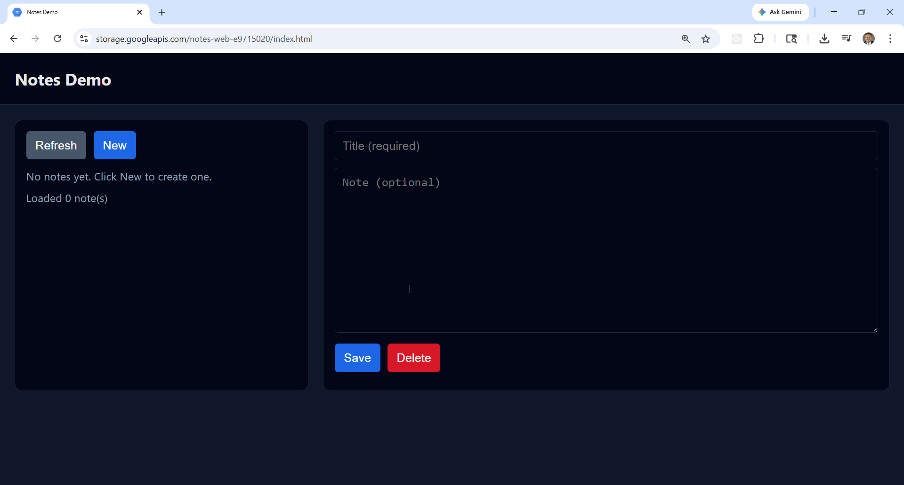
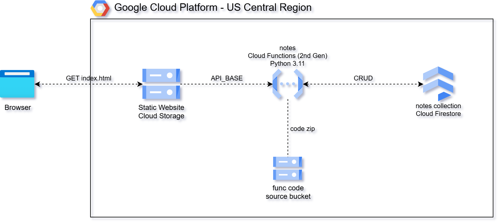

# GCP Serverless CRUD API with Cloud Functions, Firestore, and Cloud Storage

This project delivers a fully automated **serverless CRUD (Create, Read, Update,
Delete) API** on Google Cloud Platform, built using **Cloud Functions (2nd Gen)**,
**Cloud Firestore**, and **Cloud Storage**.



It uses **Terraform** and **Python** to provision and deploy a **stateless,
REST-style backend** that exposes HTTP endpoints for managing simple "notes" data
— all without running or managing any virtual machines or containers.

For testing and demonstration purposes, a lightweight **HTML web frontend**
interacts directly with the deployed API, allowing users to create, view, update,
and delete notes from a browser.



This design follows a **serverless microservice architecture** where a single
Cloud Function routes requests by HTTP method and path, Firestore provides fully
managed NoSQL persistence, and GCP handles scaling, availability, and fault
tolerance automatically.

Key capabilities demonstrated:

1. **Serverless CRUD API** – Implements REST-style endpoints backed by a single
   Cloud Function that routes all five operations internally by method and path.
2. **Stateless Compute Layer** – The function is independent and stateless,
   enabling horizontal scaling and zero idle cost.
3. **Managed NoSQL Storage** – Uses Firestore (Native mode) for low-latency,
   fully managed document persistence with no capacity planning required.
4. **Infrastructure as Code (IaC)** – Terraform provisions the Cloud Function,
   service account, IAM bindings, GCS buckets, and supporting resources in a
   repeatable, auditable way.
5. **Browser-Based Test Client** – A simple static HTML frontend served from
   Cloud Storage demonstrates real-time interaction with the API without
   requiring additional tooling.

Together, these components form a **clean, minimal reference architecture** for
building serverless APIs on GCP — suitable for learning, prototyping, or extending
into more advanced event-driven and authenticated microservices.

## API Endpoints

The **Notes API** exposes REST-style CRUD endpoints through a **Cloud Functions
2nd Gen HTTP function**. All endpoints return JSON and work with both CLI and
browser-based clients.

The base URL after deployment is:
```
https://us-central1-<project_id>.cloudfunctions.net/notes
```

> Note: In this simplified demo, the note `owner` is hardcoded to `"global"` in
> the function handler.

### API Endpoint Summary

| Method | Path | Purpose | Input | Firestore Operation |
|--------|------|---------|-------|---------------------|
| POST | `/notes` | Create a new note | JSON body (`title`, `note`) | `document.set()` |
| GET | `/notes` | List all notes | None | `collection.where(owner).stream()` |
| GET | `/notes/{id}` | Retrieve a single note by ID | Path param (`id`) | `document.get()` |
| PUT | `/notes/{id}` | Update an existing note | Path param + JSON body | `document.update()` |
| DELETE | `/notes/{id}` | Delete a note by ID | Path param (`id`) | `document.delete()` |

### Request & Response Characteristics

| Aspect | Behavior |
|--------|----------|
| Authentication | None (demo-only) |
| Content Type | `application/json` |
| Owner Model | Hardcoded to `"global"` |
| Response Format | JSON |
| Clients | curl, browser, any HTTP client |
| Error Handling | Standard HTTP status codes |

---

### POST /notes

**Purpose:**
Creates a new note in Firestore.

**Request Body (JSON):**
```json
{
  "title": "Test Note 1",
  "note": "This is test note 1"
}
```

**Parameters:**

| Field | Type | Required | Description |
|-------|------|----------|-------------|
| title | string | Yes | Note title |
| note | string | Yes | Note body/content |

**Example Request:**
```bash
curl -s -X POST https://us-central1-<project_id>.cloudfunctions.net/notes \
  -H "Content-Type: application/json" \
  -d '{"title":"Test Note 1","note":"This is test note 1"}'
```

**Example Response (201):**
```json
{
  "id": "2f2d0c5a-9f5f-4d7d-9e2c-1c8a5b8e3c21",
  "title": "Test Note 1",
  "note": "This is test note 1"
}
```

---

### GET /notes

**Purpose:**
Lists all notes for the demo owner (`"global"`).

**Example Request:**
```bash
curl -s https://us-central1-<project_id>.cloudfunctions.net/notes
```

**Example Response (200):**
```json
{
  "items": [
    {
      "owner": "global",
      "id": "2f2d0c5a-9f5f-4d7d-9e2c-1c8a5b8e3c21",
      "title": "Test Note 1",
      "note": "This is test note 1",
      "created_at": "2026-01-19T14:12:09.123456+00:00",
      "updated_at": "2026-01-19T14:12:09.123456+00:00"
    }
  ]
}
```

---

### GET /notes/{id}

**Purpose:**
Retrieves a single note by ID.

**Example Request:**
```bash
curl -s https://us-central1-<project_id>.cloudfunctions.net/notes/<id>
```

---

### PUT /notes/{id}

**Purpose:**
Updates an existing note.

**Request Body (JSON):**
```json
{
  "title": "Test Note 1",
  "note": "Updated note"
}
```

---

### DELETE /notes/{id}

**Purpose:**
Deletes a note by ID.

**Example Request:**
```bash
curl -s -X DELETE https://us-central1-<project_id>.cloudfunctions.net/notes/<id>
```

## Prerequisites

* [A Google Cloud Platform Account](https://console.cloud.google.com/)
* [Install gcloud CLI](https://cloud.google.com/sdk/docs/install)
* [Install Terraform](https://developer.hashicorp.com/terraform/install)
* [Install jq](https://stedolan.github.io/jq/download/)
* A GCP service account JSON key file saved as `credentials.json` in the repo root

The service account needs permissions to create Cloud Functions, Firestore,
Cloud Storage, Cloud Run, Cloud Build, and IAM bindings.

## Download this Repository

```bash
git clone https://github.com/mamonaco1973/gcp-crud-example.git
cd gcp-crud-example
```

## Build the Code

Place your `credentials.json` in the repo root, then run [apply](apply.sh) to
provision all infrastructure.

```bash
~/gcp-crud-example$ ./apply.sh
NOTE: Running environment validation...
NOTE: Validating required commands...
NOTE: gcloud found.
NOTE: terraform found.
NOTE: jq found.
NOTE: credentials.json found.
NOTE: Authenticating with GCP project: my-project-id
NOTE: Enabling required GCP APIs...
NOTE: Ensuring Firestore database exists in native mode...
NOTE: API setup complete.
NOTE: Deploying Cloud Function and Firestore...

Initializing the backend...
```

### Build Results

When the deployment completes, the following resources are created:

- **Core Infrastructure:**
  - Fully serverless architecture — no VMs, containers, or VPC networking required
  - Terraform-managed provisioning of Cloud Functions, Firestore, and Cloud Storage
  - Stateless, request-driven design where each API call is handled independently

- **Security & IAM:**
  - Dedicated service account (`notes-sa`) with scoped `datastore.user` role
  - Principle-of-least-privilege: the function only has Firestore read/write access
  - No long-lived credentials embedded in application code

- **Cloud Firestore Collection:**
  - `notes` collection storing documents keyed by UUID
  - Each document stores `owner`, `id`, `title`, `note`, `created_at`, and `updated_at`
  - Native mode with serverless, automatic scaling

- **Cloud Function (`notes`):**
  - Single Python 3.11 function handling all five CRUD operations
  - Routes by `request.method` and `request.path` — no API Gateway required
  - Publicly invokable via Cloud Run IAM (`allUsers` → `roles/run.invoker`)

- **Static Web Application (Cloud Storage):**
  - Public GCS bucket configured for static website hosting
  - `index.html` provides a lightweight browser-based interface for managing notes
  - Frontend dynamically calls the deployed Cloud Function endpoint

- **Automation & Validation:**
  - `apply.sh`, `destroy.sh`, and `check_env.sh` automate provisioning, teardown,
    and environment validation
  - `validate.sh` performs end-to-end API verification using curl and jq
  - Entire workflow runs using Terraform and gcloud CLI — no manual console setup required

Together, these resources form a **clean, minimal serverless CRUD application**
that demonstrates modern GCP API design principles — simple, scalable, and fully
managed from infrastructure to application code.
